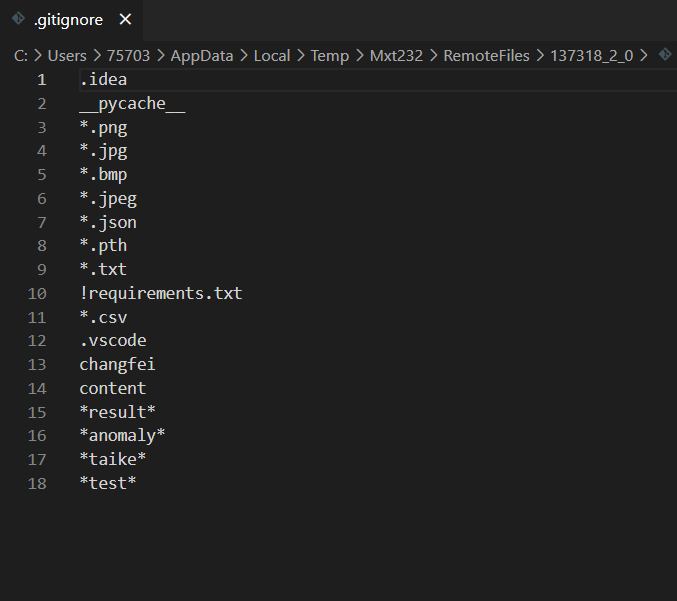

# Git 管理代码

1. pull
   1. 新建文件夹，git clone 地址
   2. git branch查看分支


.gitignore设置commit时忽视的文件（git add . 之前）




git add .  # 加入暂存区

git status  # 确认暂存区

git rm filename  # 从暂存区删除某文件

git reset # 删除暂存区所有文件

git commit -m “提交版本注释”


git push 提交到远程仓库


以下是 `git merge` 的使用步骤：

1. **切换到目标分支：** 在合并修改之前，你需要切换到你想要合并修改的目标分支。你可以使用 `git checkout` 命令来切换到目标分支。

   ```
   bashCopy code
   git checkout <target_branch>
   ```

2. **运行合并命令：** 一旦你在目标分支上，你可以使用 `git merge` 命令将源分支的修改合并到目标分支中。

   ```
   bashCopy code
   git merge <source_branch>
   ```

3. **解决冲突（如果有）：** 如果Git在合并过程中遇到目标分支和源分支之间的冲突，它会暂停合并过程并告知你存在的冲突。你需要手动解决这些冲突，保存修改，并使用 `git add` 将解决后的文件添加到暂存区，然后继续合并。

4. **完成合并：** 在解决了任何冲突后，你可以通过运行 `git commit` 创建一个新的提交来完成合并，表示这些修改已经合并到目标分支中。

   ```
   bashCopy code
   git commit -m "将 <source_branch> 合并到 <target_branch>"
   ```

需要注意的是，有时候 `git merge` 可能会执行"快进"合并。这发生在两个分支之间没有分叉的修改时。在这种情况下，目标分支的提交历史将简单地更新为与源分支相匹配，而不会创建新的合并提交。

在更复杂的情况下，你可能会遇到各种合并策略和选项，但上述的基本 `git merge` 命令是在Git中合并分支修改的标准方式。在合并之前务必仔细检查修改，并测试合并后的代码以确保其按预期工作。


# VScode

1.ctrl+shift+p，选择python编译器（python:Select Interpreter）