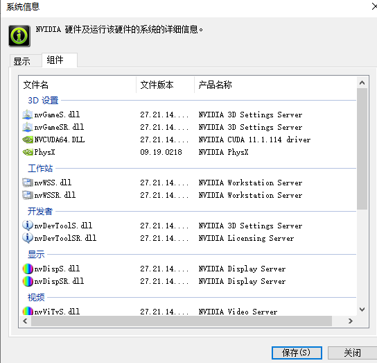
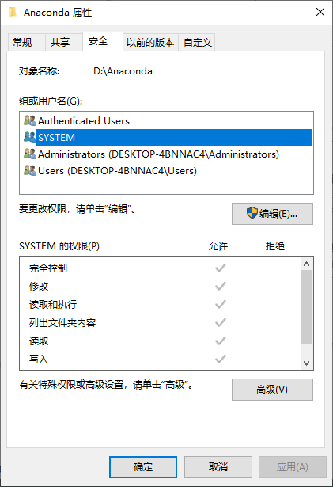

# Torch相关

nvcc-V与nvidia-smi

nvcc -V与cuda toolkit相关；与torch版本相对应

nvidia-smi与CUDA驱动相关

1.根据驱动版本安装cuda toolkit 与 cudnn，将cudnn解压后的三个文件移入cuda tooklit相应目录下

https://docs.nvidia.com/cuda/cuda-toolkit-release-notes/index.html

 驱动版本： nvidia-smi       -->     Driver Version: ***

2.

nvcc -V查看cuda版本 -- 与cuda toolkit相对应

3.根据cuda toolkit版本安装torch

Tips：

1.pycharm中添加conda环境pyhton找不到

右下角红色或找不到conda.exe时

高级  >   环境变量 >   path   > 新建  >

*anaconda/scripts* 

1.安装好anaconda

2.打开nvidia控制面板，帮助，系统信息中找到版本

3、conda添加清华镜像源：

————————————————
版权声明：本文为CSDN博主「ZQ_ZHU」的原创文章，遵循CC 4.0 BY-SA版权协议，转载请附上原文出处链接及本声明。
原文链接：https://blog.csdn.net/zzq060143/article/details/88042075

由于从官方的conda源中下载速度过于缓慢，我们需要配置清华镜像源：

conda config --add channels https://mirrors.tuna.tsinghua.edu.cn/anaconda/pkgs/free/
conda config --add channels https://mirrors.tuna.tsinghua.edu.cn/anaconda/pkgs/main/
conda config --set show_channel_urls yes

conda config --add channels https://mirrors.tuna.tsinghua.edu.cn/anaconda/cloud/pytorch/

另外为了保险起见，建议同时添加第三方conda源：

conda config --add channels https://mirrors.tuna.tsinghua.edu.cn/anaconda/cloud/conda-forge/
conda config --add channels https://mirrors.tuna.tsinghua.edu.cn/anaconda/cloud/msys2/
conda config --add channels https://mirrors.tuna.tsinghua.edu.cn/anaconda/cloud/bioconda/
conda config --add channels https://mirrors.tuna.tsinghua.edu.cn/anaconda/cloud/menpo/

4、创建并进入虚拟环境

conda create -n pytorch
conda activate pytorch
5、安装pytorch

https://pytorch.org/get-started/locally/

进入pytorch官网，根据Python和CUDA选择对应的版本，然后官方给出提示可通过运行：

conda install pytorch torchvision cudatoolkit=10.2 -c pytorch
但是这里一定要注意，去掉**-c pytorch**，安装的时候才会默认从清华源下载相应的包，因此这里用命令行:

conda install pytorch torchvision cudatoolkit=10.2
接着等待安装成功就好了。

最后可以通过命令行验证一下，可以看到已经正确安装PyTorch1.4.0，且可以调用GPU。

import torch

print(torch.__version__)
print("gpu", torch.cuda.is_available())

这是anaconda3文件夹权限问题，可能安装在默认C盘路径就不会出现问题。通过搜索发现有sudo的解决办法但在win环境下比较麻烦。这时候win系统的优秀图形界面交互功能就显得方便而愉快（对我这种菜鸟而言。。。）
选择anaconda3文件夹右键属性
点击安全后，发现的确当前的权限没有达到完全控制

选择第二个，完全控制，然后点击确定

重新执行安装指令，安装成功！
————————————————
版权声明：本文为CSDN博主「winnie爱学习」的原创文章，遵循CC 4.0 BY-SA版权协议，转载请附上原文出处链接及本声明。
原文链接：https://blog.csdn.net/qq_35668469/article/details/108284556